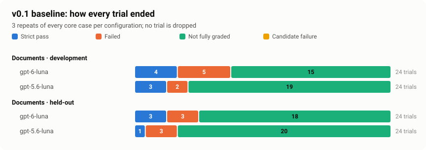

# Royal-Lab

Private benchmark for NSW residential builder office work: evidence-backed
commercial analysis, decisions, document understanding and approved operations.
Designed for any residential builder using an explicit, versioned business policy.

The benchmark has **28 definitions** (16 document/analytical, 12 operational) and
**52 case packs**: 28 core cases for D01–D16/T01–T12, plus variants, diagnostics and
specimens. They are set in two independent fictional worlds, which keep development
and held-out evidence separate. An owner business review is recorded for every
pack.

Grading combines deterministic gates (money, dates, parties, effects) with a
calibrated two-judge pair for semantic criteria. v0.1 is frozen in
[`releases/v0.1.json`](releases/v0.1.json); see the [changelog](CHANGELOG.md).

## v0.1 results

The baselines ran on 2026-10-05: `gpt-6-luna` vs `gpt-5.6-luna`, three repeats of
every core case, on documents profile 1.2.0. All 96 document trials completed. The
fixed-tools profile (72 trials) is tracked in the v0.1 follow-up.



| Configuration (both splits) | Strict pass | Failed | Not fully graded |
| --------------------------- | ----------: | -----: | ---------------: |
| `gpt-6-luna`                |           7 |      8 |               33 |
| `gpt-5.6-luna`              |           4 |      5 |               39 |

There is **no headline rate yet**. Most completed trials have an unsettled judge
disagreement, or a prose figure the checker could not find, and the report does not
estimate around them. A new judge version is the planned fix. The
[v0.1 results](docs/results-v0.1.md) cover:

- per-case outcomes and the per-case chart;
- cost and speed;
- the first pass on profile 1.1.0;
- the measurement-quality findings.

This is an initial comparison on a small private suite, not a model ranking.

## Reviewer forms

The **Builder Review Desk** (`site/review-desk/`) is a static page for builders
with little technical background. Reviewers use it to:

- check the 16 calibration answers, blind,
- review any of the 52 task packs, and
- suggest new jobs using made-up details.

Everything is written in plain language. Spreadsheets show as tables, emails as
emails, and markdown as formatted text. Evidence reads like "the estimate
workbook, row 8". Technical detail sits in optional sections.

**Live at [uprez-net.github.io/Royal-Lab](https://uprez-net.github.io/Royal-Lab/)**
(reviewers need a personal link to open it). `.github/workflows/review-desk-pages.yml`
publishes only `site/review-desk` on every change to it. The page holds no content,
answers or credentials. Task content and answers live in private Vercel Blob:

1. `pnpm review-desk:content` builds the reviewer-visible content from the
   repository and uploads it to `content/desk.json`. Re-run it after packs change.
2. `pnpm review-desk:invite --name "Jane Citizen" --business "Citizen Homes"`
   prints a personal link. Send it privately.
   - The link can read the content, and read or overwrite only that reviewer's
     four files at `{builder-name}/{type}/{type}.json`. The types are
     `profile`, `labels`, `reviews` and `proposals`.
   - Vercel caps links at 7 days. Running the command again for the same name
     issues a fresh link to the same folder, so answers carry over.
   - `review-desk/invites.json` records who was invited (it holds no links).
3. `pnpm review-desk:sync` pulls every reviewer's files into
   `review-desk/submissions/{builder-name}/{type}/`. Once a reviewer sends all 16
   labels, it also writes `labels/calibration-labels.json`, ready for
   `pnpm lab calibration-record --labels`. Add `--dry-run` to preview.

The scripts read only `BLOB_READ_WRITE_TOKEN` from `.env`, never the rest of the
file, and the token never reaches the browser. A submission is input, not a
recorded review: labels still go through `calibration-record`, and pack reviews
through `src/fixtures/reviews.ts`.

## Start

Read the [documentation guide](docs/README.md),
[setup and prerequisites](docs/getting-started.md) and
[architecture](docs/architecture.md) for the case lifecycle, environment assumptions,
dependencies, trust boundaries and current execution limits.

Use Node 24 LTS and pnpm 11.1.2.

```sh
pnpm install --frozen-lockfile
pnpm tui
```

The Ink workbench supports arrows or j/k, Tab or left/right to change sections,
Enter to inspect/check, Escape to go back and q to quit. It adapts to terminal width,
uses the alternate screen, and performs only offline authoring operations.
Piped/CI commands use the CLI below. Set NO_COLOR=1 for uncolored output.

```sh
pnpm lab --help
pnpm run list
pnpm describe offers/reconcile-quote-build-up/cedar
pnpm describe offers/reconcile-quote-build-up/cedar --visible --json
pnpm validate
pnpm fixtures:lint
pnpm fixtures:generate --check
pnpm lab controls
pnpm check
```

The first document case contains a fictional source pack and visible policy,
requests facts.json and review.md, and keeps its fixture/rubric/provenance separate.
`--visible` constructs a new allowlisted projection; it never emits hidden grading
or repository configuration. `validate` checks every selected case before reporting.
`validate --for-run` currently exits nonzero because human review is pending.
`run` requires an explicit paid-execution flag and approved source/world/verifier
packs; `grade` rechecks frozen saved evidence without candidate calls. Semantic
criteria require explicit opt-in judges or preserved judge-response replay;
real calibration remains pending. Reserved report/compare commands exit 3.

```sh
pnpm schemas:export
pnpm lab validate --artifact results/example/result.json --kind result
pnpm lab validate --artifact results/example/trace.jsonl --kind trace
pnpm lab validate --artifact results/example/manifest.json --kind manifest
pnpm build
node dist/cli.js list --json
```

Generated fixtures are already committed. Generation creates missing canonical
files and refuses to overwrite edited ones. Bump versions/review deliberately;
the check mode detects drift. No production identities, templates or transcripts
are inputs to the generator. Human approval is intentionally not generated.

## Formatting

`pnpm format` formats authored TypeScript, TSX, JSON, Markdown and YAML;
`pnpm format:check` verifies them without edits and runs as part of `pnpm check`
and CI. Prettier is pinned in the lockfile. EditorConfig and Git enforce LF line
endings, including on Windows. VS Code recommends the Prettier extension and
formats on save using this repository's configuration.

Canonical generated schemas and fixture/task/suite packs are excluded from
Prettier: their exporters own the exact bytes and frozen hashes. Check them with
`pnpm fixtures:generate --check` and schema export/drift checks instead.

## Architecture and imports

Native package imports (`#contracts/task`, `#tasks/validate`, `#fixtures/world`,
`#runs/accounting`, `#src/config`, `#tui`) resolve source under the development
condition and compiled JavaScript in production. No runtime alias rewriting is
needed. The supplied source scripts set the development condition; compiled scripts
omit it. Vitest/TypeScript resolve the same development mapping.

See [benchmark specification](docs/benchmark-spec.md), [source audit](docs/audit.md),
[case capability matrix](docs/capability-matrix.csv), [57-tool inventory](docs/tool-capability-matrix.csv),
[task authoring](docs/task-authoring.md), [contracts](docs/contracts.md),
the [draft case library](docs/authored-cases.md),
the [business review pack](docs/review-pack.md), and [configuration inputs](docs/configuration.md).

Business policy outranks product behavior. A bridge limitation or disagreement is
recorded explicitly; no competing product rule is copied into Royal-Lab.
Everything remains private/proprietary. Nothing here authorizes a public release.
