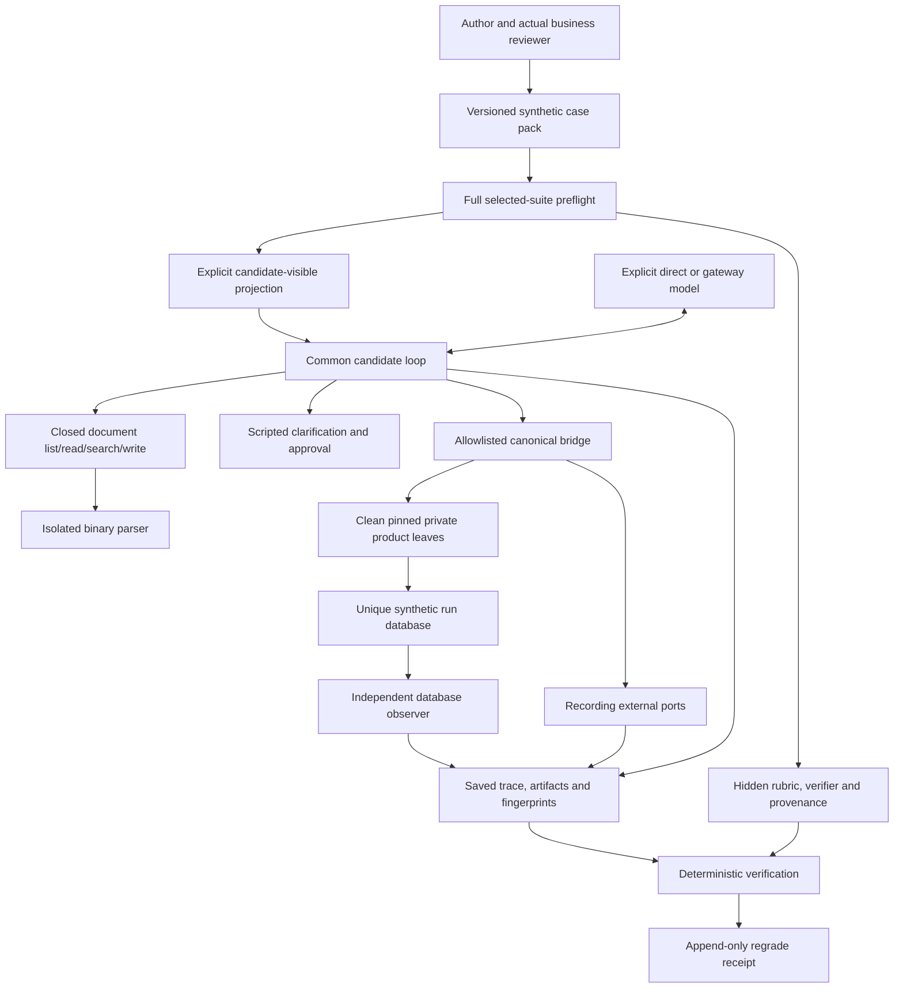

# Architecture and benchmark lifecycle

## What is being measured

A task represents a builder office assignment, such as reconciling a quote,
explaining a forecast, summarizing cash flow or creating a lead follow-up. The
candidate must discover relevant evidence, reconcile conflicting information,
ask focused questions when necessary, follow the visible builder policy, and
produce the declared artifacts or approved operational effect.

Definitions D01–D16 cover documents and analysis; T01–T12 cover operations. The
catalogue is a roadmap. Four authored draft specimens cover D01, D13, D14 and D15;
28 definitions do not mean 28 runnable cases. Fictional Cedar and Estuary worlds
are structurally different, separated between development and held-out data.

## Components and trust boundaries

The document CLI is implemented for one reviewed trial. The fixed-tools API and
integration controls compose the bridge and operator; there is no release-ready
operational case or full operational CLI run yet. Semantic judges, repeated suite
execution, reports/comparisons and the composed Royal Eve profile are later work.

| Layer                    | Main paths                                                   | Responsibility                                                                           |
| ------------------------ | ------------------------------------------------------------ | ---------------------------------------------------------------------------------------- |
| CLI and TUI              | `src/cli.ts`, `src/tui.tsx`                                  | Inspect, validate, prepare, execute supported commands and display honest readiness      |
| Contracts                | `src/contracts/`, `schemas/`                                 | Strict runtime contracts and exported portable schemas                                   |
| Cases and fixtures       | `scope/`, `tasks/`, `fixtures/`, `suites/`, `profiles/`      | Definitions, synthetic worlds, selected cases, input versions and permitted tools        |
| Integrity and projection | `src/tasks/`, `src/io.ts`, `src/environments/path-policy.ts` | Hash/reference checks, review gates, safe scoped paths and explicit visible fields       |
| Document extraction      | `src/documents/`, `sandbox/document-parser/`                 | Bounded text units, source locators, extraction gaps and reader fingerprints             |
| Candidate loop           | `src/harness/`                                               | Shared prompts/tools, lazy provider adapters, budgets, usage and trace events            |
| Operational environment  | `src/environments/`                                          | Session permissions, exact approval bindings, operator branches and replay journals      |
| Canonical bridge         | `src/environments/guri/`                                     | Import safe pinned product leaves, provision synthetic state and observe durable effects |
| Grading                  | `src/grading/`                                               | Exact facts, scoped prose, citations, state, effects and trace safety checks             |
| Run evidence             | `src/runs/`, ignored `results/`                              | Manifests, frozen execution inputs, saved artifacts, accounting and offline regrading    |

## Anatomy of a case

A case directory under `tasks/<family>/<assignment>/<world>/` contains a task
contract, visible source/policy files and hidden grading/provenance material.
The task names input IDs and hashes, the frozen clock, allowed tool versions,
deliverables, profile compatibility and budget limits. Its hidden rubric and
verification plan are referenced by path and hash.

Candidate-visible fields are constructed from an allowlist: assignment, source
and policy descriptors, clock, tools, deliverables and limits. The candidate sees
source text through document tools. Rubrics, expected values, fixture worlds,
provenance, credentials, source checkout and other runs are excluded. A provider
request necessarily transmits the selected visible assignment and evidence to
the explicitly configured provider; offline checks do not transmit them.

Versions for task, scenario, fixture, rubric, policy, profile and parser are
distinct. A changed expected answer or grading meaning requires a deliberate
version/review update. Schema 1.1.0 adds frozen hidden verifier references;
1.0.0 artifacts retain their original meaning.

## From authoring to execution

1. An author creates original synthetic evidence, visible builder policy, hidden
   expectations and negative controls. Canonical helper outputs can inform draft
   numerical oracles, but do not establish intended business correctness.
2. Offline validation checks shape, paths, hashes, cross-file references, tools,
   clocks, evidence locators and world/split isolation across the selected suite.
3. A real named builder reviewer approves the policy, source/world packs,
   expectations and verification plans. The generator never supplies approval.
4. Run preflight additionally requires actual review and implemented execution.
   A failure is retained for every selected case before any candidate API call.
5. A supported trial freezes inputs and effective budgets, records a clean runner
   revision and dependency hash, then resolves the explicitly named local key.
   Both the CLI and low-level paid harness require execution opt-in.
6. The common loop serializes tool dispatch and approvals. It records provider
   metadata, usage, attempts, executions, answers, questions and termination.
7. Artifacts and independently observed effects are checked against the frozen
   hidden plan. Saved evidence can be regraded without rerunning the candidate.

The current CLI requires `repeats: 1` and `concurrency: 1`. It retains the full
suite selection and marks other cases explicitly excluded for the selected single
trial. This is not a full-suite result. Broader repeated/concurrent orchestration
belongs to #16.

## Document evidence

Raw bytes, reader implementation and normalized extracts have separate hashes.
Text/Markdown use line references, JSON uses escaped pointers, CSV uses logical
rows and EML retains header/body references. PDF uses page/line locators; DOCX
retains paragraphs/tables/parts; XLSX retains cells, formulas and cached values
separately. Missing OCR text, email attachment extraction or spreadsheet caches
are explicit gaps rather than invented content.

The candidate has bounded `list`, `read`, `search` and `write` tools. Read cursors
allow long evidence units to be reached; outputs are confined to declared
deliverables. The controller rejects traversal, symlinks and junction escapes.
These checks are a closed tool surface, not a general OS sandbox for the entire
Node process. Binary parsing adds a separate Docker boundary with no network,
host mounts or credentials and bounded time/resources/output.

## Operations, approval and replay

Royal-Construction remains a separate, clean checkout at the audited revision.
The bridge bundles safe canonical leaf commands into an ignored cache. It rejects
unsupported imports and records product revision, source, lockfile, schema and
bundle hashes. Product behavior that conflicts with intended builder policy is
recorded as a disagreement; affected operations remain unsupported.

The current operational slice is `find_leads`, `list_lead_tasks` and
`create_lead_task`. Each integration run creates a unique marked synthetic
database. Commands receive a controlled environment and principal, with a frozen
domain clock. A separate connection observes rows, canonical history and journal
after commit. PostgreSQL infrastructure timestamps are not a frozen domain clock.

Approval binds owner, session, operation ID, tool and exact arguments. Cancellation,
another responder or changed arguments prevent the write. A canonical lead-task
write and its experiment journal commit in one PostgreSQL transaction. Replaying
that operation returns the recorded outcome; a new intentional action gets a
new operation. Raw provider call IDs are scoped to their model turn so a reused ID
does not collapse distinct intentions. Uncertain effects are not blindly retried.

Recording ports are synthetic evidence for success/fault/cancel/replay; they do
not send email, issue a Xero invoice or call DocuSign. Unimplemented service effects
return an explicit unsupported result. Stale-version scenarios for broader
canonical operations remain pending those adapters.

## Scoring and error interpretation

Execution and grading are separate. `completed` means the candidate loop finished
and artifacts were retained; it does not mean the task is correct. Deterministic
checks cover exact structured facts, reviewed scoped prose, normalized citations,
durable state/history, recording-port outcomes and trace permissions.

Monetary expectations use integer AUD cents. Date-only, equivalent instant and
Sydney business-date assertions are distinct. General prose meaning is outside
the scoped deterministic matcher and belongs to semantic grading in #11.

Every mandatory criterion, including semantic criteria, must pass for strict
success. Critical errors cannot be averaged away. Missing evidence is error or
unverified, never a pass; unavailable judges leave semantic criteria ungraded.
Current specimens therefore cannot produce a complete benchmark score.

Candidate budget exhaustion is a candidate failure; missing reviewed input or
unsupported case capability is blocked/invalid; parser/provider/controller failures
are infrastructure errors. Unknown token usage or unanswered failed requests
retain null usage/cost, stop further paid requests and do not manufacture a free
run. Budgets use declared versioned pricing and bounded reservations; provider
accounting remains authoritative.

Selection accounting preserves excluded, invalid, failed and missing trials.
A comparable headline success rate requires a complete, compatible experiment;
partial graded subsets are diagnostics with their own explicit denominator.

## Saved evidence and reproducibility

| Saved file                     | Purpose                                                                                        |
| ------------------------------ | ---------------------------------------------------------------------------------------------- |
| `preflight.json`               | Full selected-suite readiness and failures, including blocked drafts                           |
| `setup-error.json`             | Setup failure and selected cases when preparation fails                                        |
| `manifest.json`                | Trial selection, exclusions, status, versions, provider settings and pricing fingerprint       |
| `grading-inputs.json`          | Frozen hidden task/rubric/verifier snapshot and runner identity                                |
| `configuration.json`           | Exact prompt/tool/parser/provider/limit/pricing/environment fingerprints with secrets redacted |
| `prompt.txt`, `documents.json` | Saved system prompt and normalized evidence                                                    |
| `trace.jsonl`                  | Ordered provider, candidate, attempted/executed tool, interaction and effect events            |
| `outputs/`, `result.json`      | Declared artifacts/hashes, execution status, usage and grading status                          |
| `execution-receipt.json`       | Hashes binding saved execution evidence                                                        |
| `grade-<uuid>.json`            | New offline grading receipt; original execution evidence is kept                               |

Blocked setup may have only preflight/error evidence. Fixed-tools controls also
retain independent state and recording-port evidence; the document CLI does not
claim to observe a product database. Regrading verifies hashes and identities
before reading deliverables. Hash receipts detect drift against trusted saved
receipts; they are not third-party signatures or a guarantee against an attacker
who can replace the entire evidence directory.

Provider models can still change behind a model identifier. Frozen fingerprints,
raw response metadata and pricing make experiments auditable, not perfectly
deterministic. Temperature zero is not a reproducibility guarantee.
