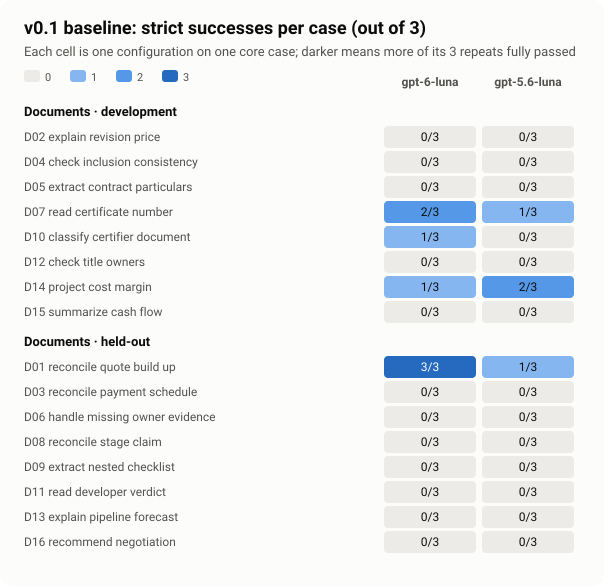

# v0.1 results (private)

The v0.1 baselines ran on 2026-10-05 against the frozen
[release manifest](../releases/v0.1.json): `gpt-6-luna` vs `gpt-5.6-luna`, three repeats
of every core case, judged by the calibrated `release-deepseek-qwen` pair.

- **Done:** the documents profile, 16 cases and 96 trials, on documents profile 1.2.0
  (`read` 1.1.0).
- **Not yet run:** the fixed-tools profile (12 cases, 72 trials). Its CI run needs read
  access to the pinned bridge source. It is tracked in the v0.1 follow-up issue.

**This is an initial comparison on a small private suite, not a ranking of
construction models.** No trial was dropped. Failed, errored and ungraded trials stay
in every denominator.




## Outcomes (documents profile 1.2.0)

| Partition               | Configuration  | Strict pass | Failed | Not fully graded | Candidate failure | Trials |
| ----------------------- | -------------- | ----------: | -----: | ---------------: | ----------------: | -----: |
| Documents · development | `gpt-6-luna`   |           4 |      5 |               15 |                 0 |     24 |
| Documents · development | `gpt-5.6-luna` |           3 |      2 |               19 |                 0 |     24 |
| Documents · held-out    | `gpt-6-luna`   |           3 |      3 |               18 |                 0 |     24 |
| Documents · held-out    | `gpt-5.6-luna` |           1 |      3 |               20 |                 0 |     24 |

- **Strict pass:** every mandatory criterion passed, both deterministic and judged.
- **Failed:** fully graded, with at least one mandatory criterion failed.
- **Not fully graded:** the run completed, but a criterion could not be settled. The
  causes are a judge disagreement awaiting adjudication, a judge error, or a prose
  figure the deterministic checker could not find.
- **Candidate failure:** the model ended on a tool call the workspace rejected.

**No comparable headline rate exists**, because a headline needs every completed trial
fully graded. The report says so rather than estimating one.

Strict passes by case:

- **Development:** D07 (read certificate number, `gpt-6-luna` 2/3, `gpt-5.6-luna` 1/3),
  D14 (project cost margin, 1/3 and 2/3), and D10 (`gpt-6-luna` 1/3).
- **Held-out:** D01 (reconcile quote build-up), `gpt-6-luna` 3/3 and `gpt-5.6-luna` 1/3.

Critical gates (money, date, party and effect errors) passed in these shares of the
trials where they were checked:

- **Development:** 56% for `gpt-6-luna`, 100% for `gpt-5.6-luna`.
- **Held-out:** 83% for `gpt-6-luna`, 75% for `gpt-5.6-luna`.

## Cost and speed

| Experiment (1.1.0)           | GitHub run  | Candidate spend | Judge spend | Median trial time                              |
| ---------------------------- | ----------- | --------------: | ----------: | ---------------------------------------------- |
| `v0.1-documents-development` | 37263185691 |           $0.16 |       $0.74 | 17.5 s (`gpt-6-luna`), 21.8 s (`gpt-5.6-luna`) |
| `v0.1-documents-held-out`    | 37263192904 |           $0.17 |       $0.30 | 21.8 s (`gpt-6-luna`), 26.5 s (`gpt-5.6-luna`) |

Judge spend includes the reserved ceiling for receipts whose usage the provider did not
confirm. Both runs stayed far inside their caps ($2.50 candidate and $3 judge each).

## First pass on documents profile 1.1.0

The first documents run used `read` 1.0.0, which rejects reads of more than 100 lines
(runs 37258613011 and 37258615393). Rejected calls ended 31 of 48 `gpt-5.6-luna`
trials and 4 of 48 `gpt-6-luna` trials.

At the owner's decision, `read` 1.1.0 allows up to 1000 lines per call, still capped at
12,000 characters with a cursor. It shipped in documents profile 1.2.0, and the run was
repeated. Every trial then completed.

| Configuration (profile 1.1.0, both splits) | Strict pass | Failed | Not fully graded | Candidate failure |
| ------------------------------------------ | ----------: | -----: | ---------------: | ----------------: |
| `gpt-6-luna`                               |           6 |      6 |               32 |                 4 |
| `gpt-5.6-luna`                             |           2 |      0 |               15 |                31 |

Profiles 1.1.0 and 1.2.0 have different tool-schema hashes, so their results are never
pooled or compared as one series.

## Measurement-quality findings

These are what v0.1 exists to surface. They are findings, not grading changes, and the
existing grades are kept.

1. **Live judge disagreement is much higher than calibration suggested.** On the
   labelling set, DeepSeek and Qwen agreed with every label. On profile-1.2.0 answers,
   52 semantic criteria ended in disagreement (22 in development, 30 in held-out), and
   5 in judge errors.
   - Most disagreements are Qwen answering "pass" without citing evidence. That is
     recorded as an error, so it disagrees with DeepSeek.
   - DeepSeek's errors are timeouts and truncated responses.
   - Per the owner's decision, these stay "not fully graded" in v0.1. The fix is a new
     judge version, tracked in the follow-up issue.
2. **Prose figures often cannot be verified.** 109 deterministic prose checks found no
   scoped `Key figures` line in `review.md` in the requested `Label: value` form. Such
   checks stay unverified, not failed, by design.
3. **The `read` limit dominated the first pass.** Raising it removed every candidate
   failure; see above.
4. **The judge calibration rests on provisional, AI-written labels.** See
   [calibration](calibration.md). Finding 1 shows the labelling set is too easy to
   separate these judges.

## Reproduce

The trial bundles are in the run artifacts (copied to `results/experiments/<id>`).
Regenerate everything offline:

```sh
pnpm lab report v0.1-documents-development-20261005042252-8557ec30 --format json
pnpm lab report v0.1-documents-held-out-20261005044945-f8d97cd8 --format json
node scripts/results-charts.mjs        # writes docs/images/v0.1-*.svg and v0.1-summary.json
```

The first-pass reports regenerate the same way from `v0.1-documents-development-20261005031457-9409cfa1`
and `v0.1-documents-held-out-20261005033354-f5ef461c`, on a checkout at `6dcb0c3`.
